<p align="center">
  <picture>
    <source media="(prefers-color-scheme: dark)" srcset="assets/card-dark.svg" />
    
  </picture>
</p>

I'm a business student at emlyon who builds. I studied LLMs, generative and agentic AI at Oxford, and I use AI agents as a team: they write code, run my second brain at night, and turn ideas into shipped products. I care about one question: **what does this create, for whom, and is it worth paying for?**

<p><a href="https://martinbouvet2000-tech.github.io/"><b>→ Read the portfolio: five case studies, from agent systems to shipped products</b></a></p>

### About me

- First year of the **Global BBA at emlyon**, Gerland campus, Lyon.
- **Focus right now:** scheduled AI agents that keep working when I'm asleep, and products shipped end to end.
- **Open source:** [nightshift](https://github.com/martinbouvet2000-tech/nightshift), the core of my second brain.
- **Selling:** an e-invoicing readiness audit for small businesses, before France's 2026 deadline.

## Shipped

| Project | What it is | Live |
|---|---|---|
| **[nightshift](https://github.com/martinbouvet2000-tech/nightshift)** | Open-source second brain that works while you sleep: videos → scored Markdown notes, then a Claude Code agent consolidates the vault overnight. Offline demo in one minute. | [repo](https://github.com/martinbouvet2000-tech/nightshift) |
| **[Nous Deux](https://github.com/martinbouvet2000-tech/nous-deux)** | Private app for long-distance couples: dual time zones, real-time shared map, shared calendar with PDF/Excel import, time capsules, Web Push. React, TypeScript, Supabase (row-level security on every table, Edge Functions), CI on every push. | [demo](https://martinbouvet2000-tech.github.io/nous-deux/) |
| **[Business Idea Radar](https://github.com/martinbouvet2000-tech/business-idea-radar)** | Scans Reddit for recurring pain points and ranks them as business opportunities. Python. | [demo](https://martinbouvet2000-tech.github.io/business-idea-radar/) |
| **[Oral Médecine](https://github.com/martinbouvet2000-tech/oral-medecine)** | Revision app for medical school orals: quizzes, key phrases, progress tracking. | [demo](https://martinbouvet2000-tech.github.io/oral-medecine/) |
| **[Code Examen](https://github.com/martinbouvet2000-tech/code-examen)** | Offline-first quiz PWA for exam prep. Installable, works without network. | [demo](https://martinbouvet2000-tech.github.io/code-examen/) |
| **[Aurélia](https://github.com/martinbouvet2000-tech/aurelia-masque)** | E-commerce brand for LED light-therapy masks: Shopify theme and landing page. | [demo](https://martinbouvet2000-tech.github.io/aurelia-masque/) |

## How I build

```text
idea ──► second brain (Obsidian, PARA) ──► spec ──► Claude Code agents ──► tests ──► ship (Vercel / Pages)
              ▲                                                                         │
              └──────────── nightly agent consolidates notes, decisions, lessons ◄──────┘
```

- **Agents, not autocomplete.** Claude Code runs multi-step work: planning, parallel subagents, code review, verification before anything ships.
- **A second brain that works overnight.** My Obsidian vault is versioned on GitHub, indexed for agents, and consolidated every night by a scheduled agent.
- **Capture pipelines.** The videos I save are transcribed, scored and filed as structured idea notes automatically — the open-source core is [nightshift](https://github.com/martinbouvet2000-tech/nightshift).

### My stack

**Build**
<p>
  
  
  
  
  
  
</p>

**Agents &amp; AI**
<p>
  
  
  
  
  
</p>

**Ship &amp; run**
<p>
  
  
  
  
  
</p>

### The last twelve months

<p align="center">
  <picture>
    <source media="(prefers-color-scheme: dark)" srcset="assets/pulse-dark.svg" />
    
  </picture>
</p>

## Now

- Shipping **nightshift** in the open and looking for its first contributors.
- Selling the **e-invoicing readiness audit** to small businesses in Lyon before the 2026 deadline.
- Open to talking about AI automation for small businesses — [say hi](https://github.com/martinbouvet2000-tech/martinbouvet2000-tech/discussions) or open an issue anywhere.

<picture>
  <source media="(prefers-color-scheme: dark)" srcset="https://raw.githubusercontent.com/martinbouvet2000-tech/martinbouvet2000-tech/output/snake-dark.svg" />
  
</picture>

<sub>Both cards rebuild themselves every morning from the GitHub API (<code>scripts/build_card.py</code>, run by a GitHub Action) and the snake is regenerated twice a day. No third-party stats service, nothing to break.</sub>
