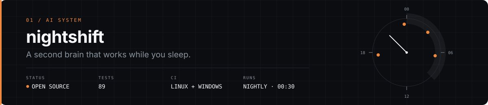
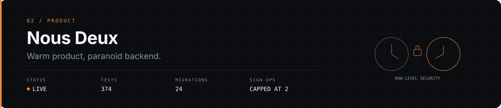
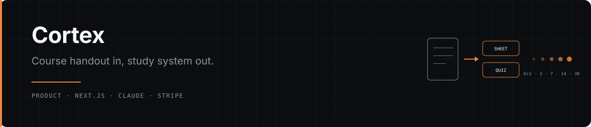

<sub>Not a decoration: this is last night's run. My second brain is consolidated by an agent at 00:30 every day, and this terminal is redrawn from what it actually did — counters only, never the contents. <a href="scripts/build_nightly.py">The generator</a> · <a href="https://github.com/martinbouvet2000-tech/nightshift">the agent, open source</a></sub>

## I run a small factory of AI-powered products

I study business at emlyon. I learned LLMs, generative and agentic AI at Oxford. Between the two, I build and ship.

I work with AI agents the way a founder works with a small team: I own the problem, the product decisions and the trade-offs; the agents compress the distance between a decision and a shipped feature. Everything above runs on a schedule, and everything below is a repository you can open.

**[Portfolio: five case studies →](https://martinbouvet2000-tech.github.io/)**

---

## Systems

<a href="https://github.com/martinbouvet2000-tech/nightshift"></a>

**The problem.** I saved hundreds of videos and remembered almost none of them. Saving is not learning.  
**What I built.** A pipeline that turns saved videos into scored Markdown notes, and a Claude Code agent that consolidates the vault overnight inside hard limits: a time window, a lock, a timeout, one retry, and a proof line it must print before the run counts as done. Its file access never leaves the vault, because a transcript from the internet is untrusted input.  
**Check it yourself.** 89 tests · CI on Linux and Windows · a demo that runs offline, with no API key, in under a minute.

[Repository](https://github.com/martinbouvet2000-tech/nightshift) · [Case study](https://martinbouvet2000-tech.github.io/work/ai-os.html)

<a href="https://github.com/martinbouvet2000-tech/nous-deux"></a>

**The problem.** Two people living apart juggle time zones, two timetables and a dozen apps to share small daily moments — with data as private as data gets.  
**What I built.** One shared space: dual clocks, an opt-in live map with 48-hour retention, a calendar that imports a whole school timetable from a PDF, and time capsules the database keeps sealed until their date. Notifications say *who* did something, never *what*.  
**Check it yourself.** Security lives in row-level policies, not in the client: 24 migrations, sign-ups capped at two accounts, 374 test cases, CI on every push.

[Repository](https://github.com/martinbouvet2000-tech/nous-deux) · [Live app](https://martinbouvet2000-tech.github.io/nous-deux/) · [Case study](https://martinbouvet2000-tech.github.io/work/nous-deux.html)

<a href="https://martinbouvet2000-tech.github.io/work/cortex.html"></a>

**The problem.** First-year medicine and law students rewrite their handouts by hand, then revise without structure. Flashcard apps don't know their course; chatbots answer from the whole internet.  
**What I built.** Drop in a PDF, get a study sheet, ten questions, a spaced-repetition plan and a tutor that answers only from that course. Freemium with Stripe, and an admin panel that runs the public site from a phone.  
**Check it yourself.** Live in production in demo mode, 33 tests, and a security pass: rate limits, CSRF checks, per-user data scoping, server-side grading. The code is private.

[Live site](https://cortex-revisions.vercel.app) · [Case study](https://martinbouvet2000-tech.github.io/work/cortex.html)

<sub>Also running: <a href="https://github.com/martinbouvet2000-tech/business-idea-radar">Business Idea Radar</a> · <a href="https://martinbouvet2000-tech.github.io/Diabete/">Diavie</a> · <a href="https://martinbouvet2000-tech.github.io/code-examen/">Code Examen</a> · <a href="https://martinbouvet2000-tech.github.io/aurelia-masque/">Aurélia</a></sub>

---

## Operating model

```text
   me                          agents                        me
   ──                          ──────                        ──
   problem  ──►  spec  ──►  build  ──►  tests  ──►  review  ──►  ship
      ▲                                                            │
      └────── the night agent consolidates what I learned ◄────────┘
              (00:30, every day, inside hard limits)
```

I decide what the problem is, who it is for, what gets cut and what "done" means. Agents own execution speed. Every run ends with a verification pass, and nothing ships on trust alone — that is why the readouts above are test counts, not adjectives.

My second brain feeds the loop: versioned on GitHub, indexed so agents can search it, consolidated every night. The reusable core is open source as [nightshift](https://github.com/martinbouvet2000-tech/nightshift).

---

## Stack

**Build** — TypeScript · React · Next.js · Python · Node  
**AI &amp; agents** — Claude Code · Anthropic API · MCP · Obsidian  
**Ship &amp; run** — Supabase · PostgreSQL · Vercel · GitHub Actions · Stripe

---

## Currently building

**nightshift v0.2** — more capture sources, and real-run coverage for the night agent.  
**E-invoicing audit** — a fixed-price readiness audit for small businesses, before France's September 2026 deadline.  
**Cortex** — a first student cohort, then switching real generation on.

---

<sub>Nothing on this page is hand-written twice. The header is rebuilt every morning from the GitHub API by <a href="scripts/build_header.py">a script in this repo</a>, the terminal at the top is redrawn from the night agent's own counters, and <a href="scripts/build_covers.py">the project covers</a> are generated the same way. If a number here is wrong, the fix is in the code, not in the prose.</sub>

**Contact** — [portfolio](https://martinbouvet2000-tech.github.io/) · [discussions](https://github.com/martinbouvet2000-tech/martinbouvet2000-tech/discussions) · [issues on nightshift](https://github.com/martinbouvet2000-tech/nightshift/issues)
